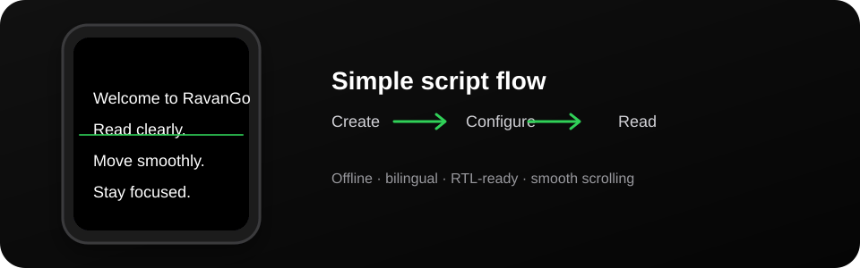
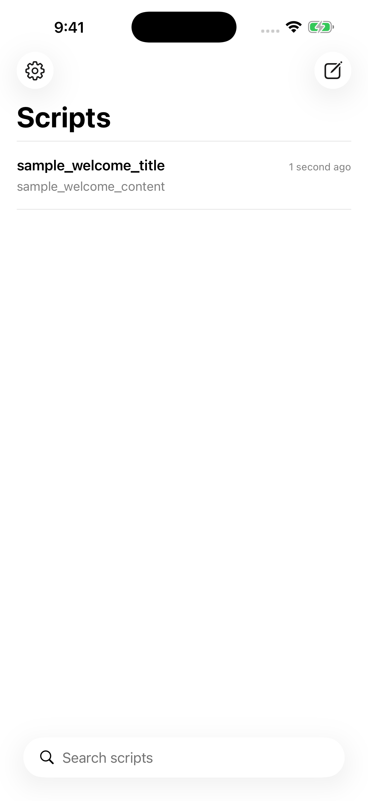
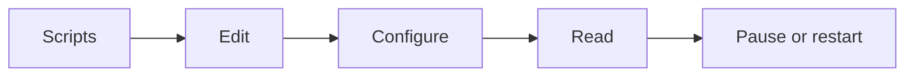
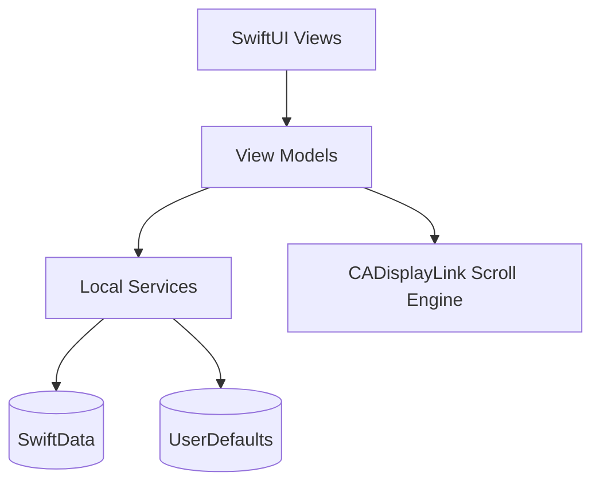
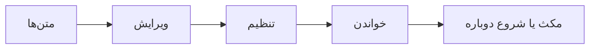

# RavanGo

  

  <strong>RavanGo by Behnam Jalali</strong> 
  A focused, offline iPhone teleprompter for clear reading.

  
  
  
  
  
  

  

  <a href="#english">English</a> · <a href="#فارسی">فارسی</a>

---

## English

### Overview

RavanGo is a native iPhone teleprompter created by Behnam Jalali.

The app keeps the reading area clear. It stores scripts and settings on the device. It works without an account, a server, or a required network connection.

### Screenshot

  

The screenshot is captured from a real iPhone Simulator by GitHub Actions after the CI build and tests pass.

### Features

- Create, edit, rename, duplicate, delete, and search scripts
- Sort scripts by the most recent edit
- Native SwiftUI editor with autosave
- Word count and speaking-time estimate
- Smooth frame-driven scrolling with `CADisplayLink` and `UIScrollView`
- Play, pause, resume, restart, and manual scrolling
- Speed presets and fine speed control from `0.25x` to `3.0x`
- Adjustable font size, line spacing, margins, alignment, colors, and reading guide
- Mirror mode for physical teleprompter glass
- Optional countdown before playback
- Lock controls during recording
- Tap gestures and keyboard/Bluetooth remote commands
- Portrait and landscape support
- English and Persian UI
- Full RTL layout support for Persian
- Automatic direction detection for Persian, English, and mixed scripts
- JSON import and export with Unicode-safe handling
- SwiftData local persistence with recoverable storage errors
- Privacy manifest for app-owned `UserDefaults` access

### Product flow

### Architecture

The project uses a small MVVM structure.

- `Models/` contains SwiftData models and preference types.
- `Views/` contains the script library, editor, settings, and teleprompter UI.
- `ViewModels/` contains playback and control state.
- `Services/` contains persistence, preferences, and import/export logic.
- `Utilities/` contains metrics, font selection, search normalization, and constants.
- `RavanGo/Resources/Fonts/` contains the local font integration point.
- `RavanGoTests/` contains focused unit tests.

The teleprompter keeps one hosted scrolling view alive. It updates the text configuration only when a relevant setting changes. The display link changes the vertical offset once per frame. This supports smooth movement, exact pause/resume behavior, manual scrolling, and progress preservation during layout changes.

### Requirements

- Current stable Xcode
- iOS 18 or later
- Swift 6 language mode
- An Apple Developer account for a physical iPhone

### Install with Xcode

1. Clone the repository.
2. Open `RavanGo.xcodeproj`.
3. Select the `RavanGo` scheme.
4. Select your Apple Developer Team.
5. Keep signing set to Automatic.
6. Build and run on a simulator or a connected iPhone.

The bundle identifier is `com.behnamjalali.ravango`. Change it in Xcode if you need a different identifier.

### IRANYekanX font setup

RavanGo supports four optional licensed Persian font files:

- `IRANYekanXFaNum-Regular.ttf`
- `IRANYekanXFaNum-Medium.ttf`
- `IRANYekanXFaNum-DemiBold.ttf`
- `IRANYekanXFaNum-Bold.ttf`

IRANYekanX is proprietary Fontiran software and is not redistributed as raw TTF files in this public repository. A clean clone builds without the fonts and falls back to the Apple system font.

Licensed users can install their local copy from the original vendor ZIP:

~~~sh
FONTIRAN_LICENSE_CODE=123456 sh scripts/install-iranyekanx.sh "/path/to/IRANYekanX(Pro).zip"
~~~

Replace `123456` with your own six-digit Fontiran license code. The code, extracted fonts, and populated `FontLicense.txt` remain local and are Git-ignored. During build, the optional files are copied into the app bundle and registered at runtime.

See [`RavanGo/Resources/Fonts/README.md`](RavanGo/Resources/Fonts/README.md) for details.

### Physical iPhone installation

1. Connect the iPhone to the Mac.
2. Trust the Mac on the iPhone if requested.
3. Select the iPhone as the run destination.
4. Select your Team under Signing & Capabilities.
5. Press Run.

RavanGo does not require a backend, login, cloud account, analytics SDK, advertising SDK, or network service.

### Local data and privacy

**All scripts and settings are stored locally on the user’s device.**

RavanGo does not track users. It does not send script content to a server. It does not include analytics, advertising, telemetry, or third-party packages. Script content leaves the device only when the user explicitly chooses an iOS share or file action.

### Import and export

Settings provides JSON export through the native iOS share sheet. Import uses the system file picker.

Import behavior is safe:

- Invalid JSON shows an error.
- Empty backups show an error.
- Imported scripts receive new local identifiers.
- Duplicate titles receive safe imported names.
- Existing scripts are not silently overwritten.
- Persian, mixed English/Persian text, numbers, punctuation, and emoji remain UTF-8 safe.

### Tests

The test target is `RavanGoTests`.

Tests cover:

- Word counting
- Speaking-time calculation
- English and Persian JSON round trips
- Malformed and empty backups
- Duplicate import titles
- Fresh imported identifiers
- Preference persistence
- Persian direction detection
- English direction detection
- Persian search normalization
- A several-thousand-word development fixture

Run tests in Xcode with **Product → Test**.

### License

RavanGo source code is licensed under the **Apache License 2.0**. See [LICENSE](LICENSE).

The repository also contains a [NOTICE](NOTICE) file for attribution and third-party asset boundaries.

IRANYekanX is separate proprietary software and is not covered by Apache-2.0. Raw font files and the populated Fontiran license file are not distributed in this public repository.

### Contributing

Keep changes focused on the teleprompter experience. Preserve offline behavior. Add focused tests for behavior changes. Do not add analytics, cloud services, accounts, or third-party packages without a product decision.

---

## فارسی

### معرفی

RavanGo یک تله‌پرامپتر Native برای iPhone است که توسط Behnam Jalali ساخته شده است.

برنامه برای خواندن سریع و بدون حواس‌پرتی طراحی شده است. متن‌ها و تنظیمات روی خود دستگاه ذخیره می‌شوند. استفاده از حساب کاربری، سرور یا اتصال اجباری به اینترنت لازم نیست.

### امکانات

- ساخت، ویرایش، تغییر نام، کپی، حذف و جست‌وجوی متن‌ها
- نمایش متن‌ها بر اساس آخرین ویرایش
- ویرایشگر Native با ذخیره خودکار
- شمارش کلمات و محاسبه زمان تقریبی خواندن
- حرکت نرم متن با `CADisplayLink` و `UIScrollView`
- پخش، مکث، ادامه، شروع دوباره و حرکت دستی
- سرعت‌های آماده و تنظیم دقیق از `0.25x` تا `3.0x`
- تنظیم اندازه متن، فاصله خطوط، حاشیه‌ها، تراز و رنگ‌ها
- راهنمای تمرکز هنگام خواندن
- حالت آینه‌ای برای شیشه تله‌پرامپتر
- شمارش معکوس پیش از شروع
- قفل کردن کنترل‌ها هنگام ضبط
- پشتیبانی از ضربه روی صفحه و کیبورد یا ریموت بلوتوث
- پشتیبانی از حالت عمودی و افقی
- رابط کاربری فارسی و انگلیسی
- پشتیبانی کامل از RTL برای فارسی
- تشخیص خودکار جهت متن فارسی، انگلیسی و متن‌های ترکیبی
- وارد کردن و خروجی گرفتن JSON با حفظ کامل Unicode
- ذخیره‌سازی محلی با SwiftData و مدیریت خطا

### مسیر استفاده

### معماری

این پروژه از ساختار ساده MVVM استفاده می‌کند.

- `Models/` مدل‌های SwiftData و تنظیمات را نگه می‌دارد.
- `Views/` کتابخانه متن‌ها، ویرایشگر، تنظیمات و تله‌پرامپتر را نگه می‌دارد.
- `ViewModels/` وضعیت پخش و کنترل‌ها را مدیریت می‌کند.
- `Services/` ذخیره‌سازی، تنظیمات و وارد کردن/خروجی گرفتن را مدیریت می‌کند.
- `Utilities/` شامل محاسبات، انتخاب فونت، نرمال‌سازی جست‌وجو و ثابت‌ها است.
- `RavanGoTests/` تست‌های متمرکز پروژه را نگه می‌دارد.

موتور تله‌پرامپتر یک Scroll View و Hosting Controller را بازسازی نمی‌کند. حرکت عمودی توسط Display Link و یک Coordinator انجام می‌شود. در نتیجه مکث، ادامه، تغییر سرعت، حرکت دستی و تغییر اندازه صفحه پایدار می‌ماند.

### نصب و اجرا

1. ریپو را Clone کنید.
2. فایل `RavanGo.xcodeproj` را در Xcode باز کنید.
3. Scheme با نام `RavanGo` را انتخاب کنید.
4. Team حساب Apple Developer خود را انتخاب کنید.
5. Signing را روی Automatic نگه دارید.
6. برنامه را روی Simulator یا iPhone اجرا کنید.

شناسه Bundle فعلی برابر است با `com.behnamjalali.ravango`. در صورت نیاز می‌توانید آن را در Xcode تغییر دهید.

### زبان و RTL

زبان پیش‌فرض برنامه انگلیسی است. زبان فارسی از بخش Settings قابل انتخاب است و رابط کاربری بدون نیاز به راه‌اندازی دوباره، تا حد امکان تغییر می‌کند.

زبان رابط کاربری و جهت متن از یکدیگر جدا هستند. بنابراین می‌توانید رابط فارسی را با متن انگلیسی، یا رابط انگلیسی را با متن فارسی استفاده کنید. جهت متن به‌صورت خودکار تشخیص داده می‌شود و متن‌های ترکیبی نیز رفتار Unicode طبیعی خود را حفظ می‌کنند.

### فونت IRANYekanX

RavanGo از چهار وزن اختیاری و لایسنس‌دار IRANYekanXFaNum پشتیبانی می‌کند. فایل خام فونت در ریپوی عمومی منتشر نمی‌شود، چون مجوز Fontiran انتشار یا اشتراک‌گذاری بدون مجوز را محدود می‌کند.

Clone تمیز پروژه بدون فونت نیز Build می‌شود و در نبود IRANYekanX از فونت سیستم Apple استفاده می‌کند.

دارنده لایسنس می‌تواند با ZIP اصلی Fontiran و کد ۶ رقمی خودش فونت‌ها را به‌صورت محلی نصب کند:

~~~sh
FONTIRAN_LICENSE_CODE=123456 sh scripts/install-iranyekanx.sh "/path/to/IRANYekanX(Pro).zip"
~~~

عدد نمونه را با کد لایسنس خود جایگزین کنید و آن را Commit نکنید. اسکریپت فقط چهار وزن Regular، Medium، DemiBold و Bold را استخراج می‌کند و `FontLicense.txt` محلی را نیز طبق فایل اصلی Fontiran می‌سازد.

### حریم خصوصی و داده محلی

**همه متن‌ها و تنظیمات روی دستگاه کاربر ذخیره می‌شوند.**

RavanGo کاربر را Track نمی‌کند. متن‌ها را به سرور ارسال نمی‌کند. برنامه فاقد Analytics، تبلیغات، Telemetry، Backend، Login و پکیج Third-party است. متن فقط در صورت انتخاب مستقیم کاربر از Share یا File System iOS خارج می‌شود.

### وارد کردن و خروجی گرفتن

خروجی گرفتن از بخش Settings و با Share Sheet خود iOS انجام می‌شود. وارد کردن نیز با File Picker سیستم انجام می‌شود.

فایل نامعتبر یا خالی با پیام مناسب رد می‌شود. شناسه‌های جدید برای متن‌های واردشده ساخته می‌شوند. عنوان‌های تکراری بدون بازنویسی متن قبلی، با نام امن وارد می‌شوند. متن فارسی، انگلیسی، عدد، نشانه‌گذاری و Emoji بدون تغییر حفظ می‌شوند.

### تست‌ها

تارگت تست `RavanGoTests` است. تست‌ها محاسبه کلمات، زمان خواندن، JSON فارسی و ترکیبی، فایل خراب یا خالی، عنوان تکراری، ذخیره تنظیمات، تشخیص جهت متن فارسی و انگلیسی و نرمال‌سازی جست‌وجوی فارسی را پوشش می‌دهند.

### لایسنس

سورس‌کد RavanGo تحت **Apache License 2.0** منتشر می‌شود. فایل [LICENSE](LICENSE) متن کامل مجوز را دارد و [NOTICE](NOTICE) مرز دارایی‌های شخص ثالث را مشخص می‌کند.

فونت IRANYekanX تحت لایسنس جداگانه Fontiran است و فایل‌های خام آن تحت Apache-2.0 قرار نمی‌گیرند.

### مشارکت

تغییرات را روی تجربه اصلی تله‌پرامپتر متمرکز نگه دارید. رفتار Offline را حفظ کنید. برای تغییرات مهم تست اضافه کنید. بدون تصمیم محصول، Analytics، Cloud، Account یا پکیج Third-party اضافه نکنید.

---

## Project status

RavanGo is an active development project. GitHub Actions validates clean builds and tests. The automated v1.0.0 GitHub release remains a pre-release until final physical-iPhone validation is complete.
